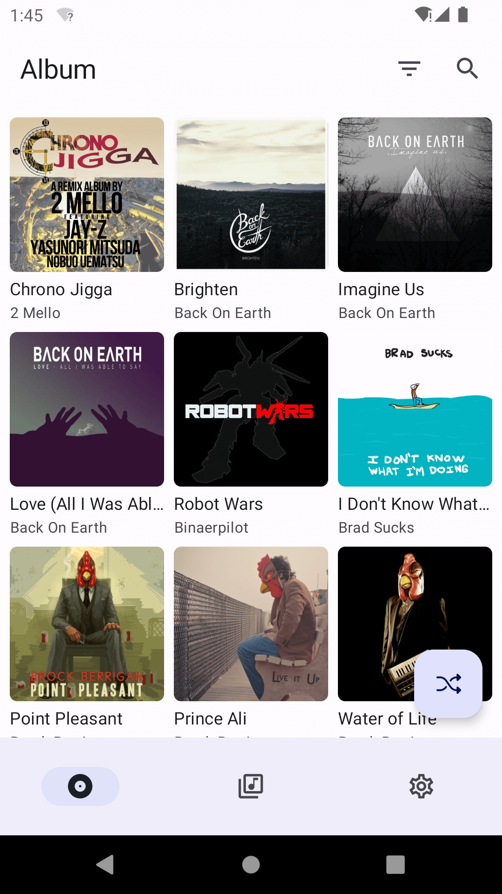
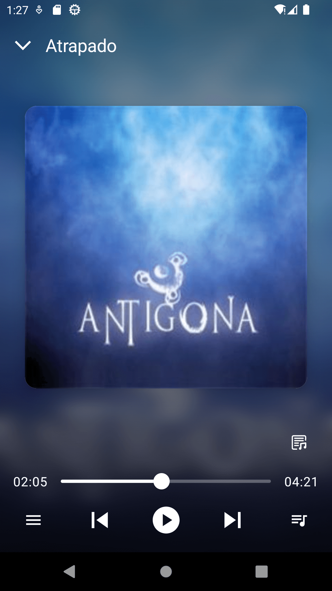

[English](README.md) | 简体中文


SubTune 是一个免费的开源音乐流媒体 Android 客户端，适用于 Subsonic API（1.13.0 或更高版本）兼容服务器（[Subsonic](http://www.subsonic.org/pages/index.jsp)、[Navidrome]( https://www.navidrome.org/)、[Airsonic](https://airsonic.github.io/) 等）。

## 界面截图

<p>
  
  
  
  
</p>

## 下载

<p>
  <a href="https://github.com/TaylorKunZhang/SubTune/releases/latest"></a>
</p>

## 特征

- Material 3 design
- 浏览专辑和歌单
- 搜索专辑和歌曲
- 设置最大比特率
- 深色模式
- 动态颜色

## License

```
Copyright 2023 Taylor Zhang

Licensed under the Apache License, Version 2.0 (the "License");
you may not use this file except in compliance with the License.
You may obtain a copy of the License at

    http://www.apache.org/licenses/LICENSE-2.0

Unless required by applicable law or agreed to in writing, software
distributed under the License is distributed on an "AS IS" BASIS,
WITHOUT WARRANTIES OR CONDITIONS OF ANY KIND, either express or implied.
See the License for the specific language governing permissions and
limitations under the License.
```